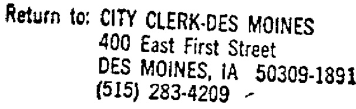
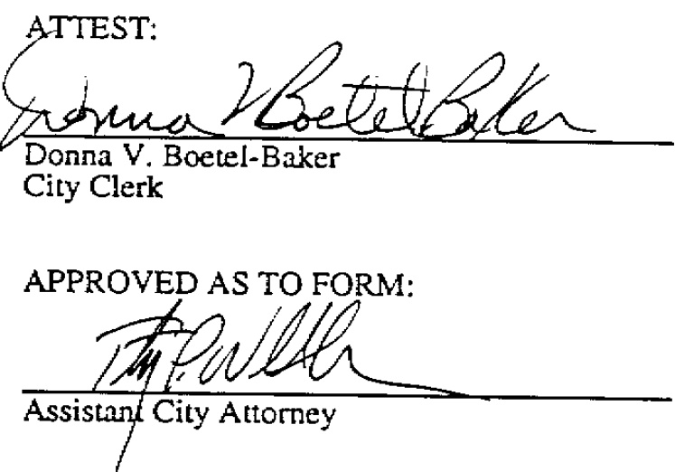
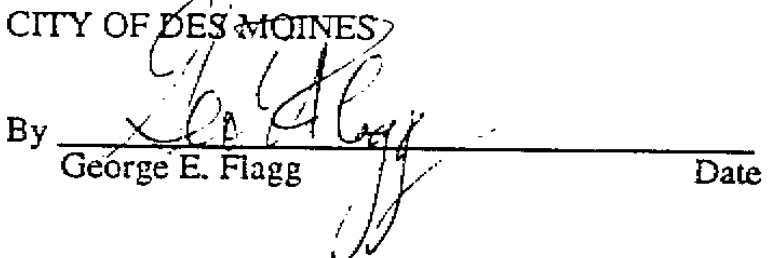
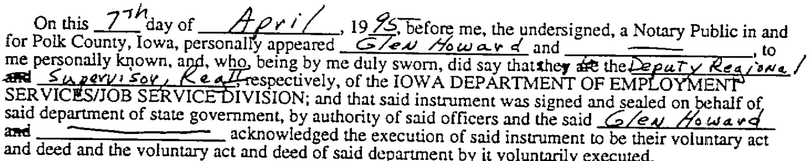
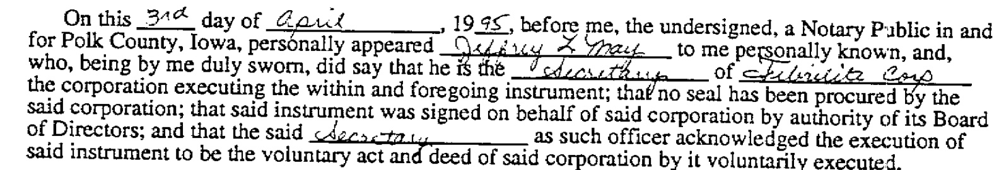
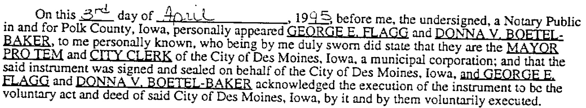
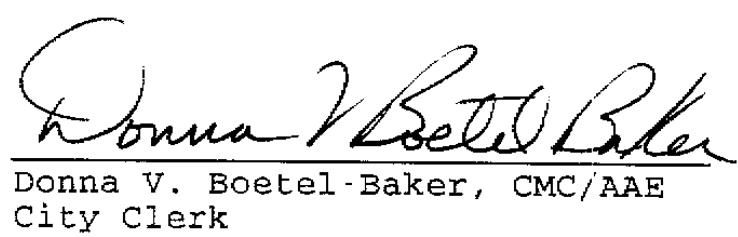

# FIRST SOURCE EMPLOYMENT AGREEMENT  

This Agreement (here in after, the "Agreement") is made by and between the Iowa Depariment of Employment Services/Job Service Division (here in after, Job Service), the City of Des Moines (here in after, the "City"), Fibrelite Corporation (here in after, the "Employer") which proposes to operate an industrial facility in Des Moines, Iowa, (here in after, the "Project") pursuant to the provisions of Chapter 28E of the Code of Iowa.  

The above-referenced development Project has received direct federal, state or local public financing of \$ 100,000 or more (excluding U.S. SBA Guarantees and urban renewal writedowns). The purpose of this Agreement is to make the permanent jobs created within the Project accessible to those qualified applicants who are most in need of a job. It is the intent of the parties that job opportunities be maximized for low and moderate income people of the community by the utilization of Job Service as the first source of hiring referrals for such jobs within the Project.  

I. CONSIDERATION  

The Employer shal in consideration of the receipt from the City of public financing in its Project use Job Service as its first source for recruitment and referral in the hiring of all non-promotional, nonprofessional permanent job openings within the development Project. Job Service shall in consideration Of being designated the first source hiring agency provide the Employer with job referrals in an expedited fashion. The City shall in consideration of the enhancement of job o port unities for low and moderate income persons require developers who are recipients of public financing to enter into.this Agreement.  

The parties do hereby agree to the folowing division of resp on sibi li ies for this jointand cooperative undertaking:  

The Employers hall use JobService as its first source for the recruitment, referral and hiring for all non-promotional, non-professional peranent job openings in he Project for t duration of this Agreement.  

2. During the first ten (10) days following the date of each job opening the Employer shall interview only applicants referred to it by Job Service. The Empioyer may negouiate a lesser time period with job Serrvice for those jobs for which there is critical need that it be filled within a shorter timeframe so long as the crisis is not of the Employer's own making and is not used to circum vent the purpose of this Agreement.  

3. The Empioyer shal interview each applicant referred by Job Service during the ten (10) day period until the job is filled or the period expires. The Employer retains at all times full choice of whom to hire.  

4. The Employer shall notify Job Service of its specific need for additional employees as soon as that need is identified together with the anticipated date of each job opening.  

  

5. Each notification to Job Service from the Employer shall include the number of employees needed by job title, qualifications, hiring dates, rates of pay, hours of work, anticipated duration of employment and work to be performed. 6. At the expiration of the ten (10) day period following the date of each job opening, the Employer shall be free to follow its standard recruitment and selection procedures to fill the vacant position(s), so long as the same full and fair consideration is given to the applicants referred by Job Service as is given to all other candidates. 7. Employer shall assist in the verification of interviews made by Job Service applicants by returming the Job Service referral card (Form 508) to Job Service, indicating whether the applicant has been hired or not hired. 8. Job openings filled by intemal promotion from the Employer's current workforce shall not be subject to this Agreement. 9. Until the period set out in Article III of this Agreement expires, the Employer shall include any and all of its responsibilities under this Agreement in any assignment, conveyance or transfer of its interest whether reai or personal property in the above-enumerated Project to another individual, limited or general partnership, corporation or other business entity.  

B. Responsibilities of Iob Service  

1. Job Service shall provide recruitment, referral and hiring services to the Employer under the terms of this Agreement. 2. Job Service shall be responsible for timely and expedited referral of qualified applicants to the Employer. 3. Job Service shall follow its standard screening procedures in determining whether the applicant is qualified for referral to the Employer. 4. Job Service shail notify the Employer prior to the anticipated hiring dates of the number of applicants Job Service anticipates referring. Job Service shall make every reasonable effort t0 refer at least two (2) qualified applicants for each job opening. 5. Job Service shall maintain appropriate statistical data on its referrals and the ultimate hiring decisions made by the Employer and shall forward such staistical data to the City on a quarterly basis.  

C. Responsibilities of the City  

1. The City shall require the Employer as a condition of receiving  $\Im{100,000}$  or moredirect federal, state or local public financing (exciuding SBA Guarantees and urban renewal writedowns) for the above-enumerated project to enter into this First Source Empioyment Agreement.  

2. The City shall secure all necessary signatures and executions and thereafier file this Agreement with the Secretary of State and file it for record with the Polk County Recorder's Office.  

3. The City upon recep t of stat is ical datafrom JobService shal review the Emloyes cmp li ance wi h th requirement so his g ree ment, th City Manager rh is dsi nee hall report on an annual basis th number of in r views and th ultima thir ng dec is sl parties to the Agreement.  

I1. DURATION AND TERMINATION  

The parties do hereby agree that:  

A This nts hal tak ft upon its filing it See rear y of State and its fling f record in the Polk County Recorder's Office, and shall expire March 31, 1998. B. Th igm eni my mint d nlby the writ tec one nt ofal pai ef ally a pro vd C. Any as i men tans fer or convey anc of teEmloyers intrest in he above-numerd Pro eth alu br man cf thE moyer sns ilse u y cha if re rur inn ret rvi de dPa th sAhasi gen as ferr on vey ance halle veh ralf any and all obligations under this Agreement.  

Iv. COSTS  

Each par y hale a is pet ive xen sea iw ihm lee hs Agm V.HOLD HARMLESS  

ex h hra iv eau  

A.Ne the J Service rt City as sue any res pons bil yl bil t by as nf ts A re le sdl dha mob vice and t it y fa als  

B.Neither Job Service or the City assume any resp on sibi ly or liabilty byreason of his A mee ment for he sufi cie n cy of the Eml oye's ml oy ment procedure and p racc en hi r in 1 meet th re q re men f feral stator loc a aw nd th ml oye rer by rce d a rst lh mo be vic and hC iy fr many and a lsu hcl ty  

This A gre men is binding upon he succes or nda signs fec hf there s pei vep  

IOWA DEPARTMENT OF EMPLOYMENT SERVICES/JOB SERVICE DIVISION  

  

FIBRELITE CORPORATION  

  

STATE OF IOWA SS: COUNTY OF POLK )  

  

ACKNOWLEDGEMENT FORM FOR JOB SERVICE  

  

  

Notary Public in and for Polk County, Iowa STATE OF IOWA SS: COUNTY OF POLK }  

ACKNOWLEDGEMENT FORM FOR CORPORATE EMPLOYER  

  

  

STATE OF IOWA } ss: COUNTY OF POLK )  

  

ACKNOWLEDGEMENT FORM FOR CITY OF DES MOINES  

  

  

# April 27, 1995  

Donna V. Boetel-Baker City of Des Moines 400 East First Street Des Moines, IA 50309-1891  

RE: Filing of 28E Agreement between the First Source Employment and the Fibrelite Corporation  

Dear Ms. Boetel-Baker:  

We have received the above described agreement which you have submitted to this office for filing, pursuant ico the provisions of Chapter 28E, Code of Iowa.  

You may consider the same filed as of April 27, 1995.  

Sincerly,  

Paul D. Pate Secretary of State  

PDP/skr Enclosures  

  

DONNA V.BOETEL-BAKER,CMCIAAE CITYCLEAK CITY HALL-2ND FOF dCCEA5=:RST SIE1 DESMCINES"WAUIA4↑151512834209  

PARKING TICKETS AND DOG LICENSES [5151783-412  

BUSINESS LICENSES 151283.4:2 ALL-AMERICA CITY 1949.I976.1981  

  

MEMO TO: Secretary of Statet Polk County Recorder  

Please file and record the enclosed documents and bill this office as appropriate:  

28-E Agreement for First Source Employment withi Fibrelite Corporation, approved by the Des Moines City Council on April 3, 1995 by Rol1 Ca11 N0. 95-1319.  

Thank you.  

  

/ ab Enclosures  