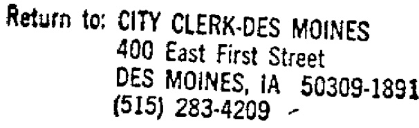

# FIRST SOURCE EMPLOYMENT AGREEMENT  

This Agreement (here in after, the "Agreement") is made by and between the Iowa Depariment of Employment Services/Job Service Division (here in after, Job Service), the City of Des Moines (here in after, the "City"), Fibrelite Corporation (here in after, the "Employer") which proposes to operate an industrial facility in Des Moines, Iowa, (here in after, the "Project") pursuant to the provisions of Chapter 28E of the Code of Iowa.  

The above-referenced development Project has received direct federal, state or local public financing of \$ 100,000 or more (excluding U.S. SBA Guarantees and urban renewal writedowns). The purpose of this Agreement is to make the permanent jobs created within the Project accessible to those qualified applicants who are most in need of a job. It is the intent of the parties that job opportunities be maximized for low and moderate income people of the community by the utilization of Job Service as the first source of hiring referrals for such jobs within the Project.  

I. CONSIDERATION  

The Employer shal in consideration of the receipt from the City of public financing in its Project use Job Service as its first source for recruitment and referral in the hiring of all non-promotional, nonprofessional permanent job openings within the development Project. Job Service shall in consideration Of being designated the first source hiring agency provide the Employer with job referrals in an expedited fashion. The City shall in consideration of the enhancement of job o port unities for low and moderate income persons require developers who are recipients of public financing to enter into.this Agreement.  

The parties do hereby agree to the folowing division of resp on sibi li ies for this jointand cooperative undertaking:  

The Employers hall use JobService as its first source for the recruitment, referral and hiring for all non-promotional, non-professional peranent job openings in he Project for t duration of this Agreement.  

2. During the first ten (10) days following the date of each job opening the Employer shall interview only applicants referred to it by Job Service. The Empioyer may negouiate a lesser time period with job Serrvice for those jobs for which there is critical need that it be filled within a shorter timeframe so long as the crisis is not of the Employer's own making and is not used to circum vent the purpose of this Agreement.  

3. The Empioyer shal interview each applicant referred by Job Service during the ten (10) day period until the job is filled or the period expires. The Employer retains at all times full choice of whom to hire.  

4. The Employer shall notify Job Service of its specific need for additional employees as soon as that need is identified together with the anticipated date of each job opening.  

  