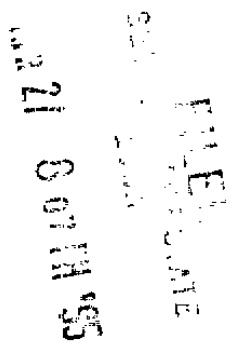
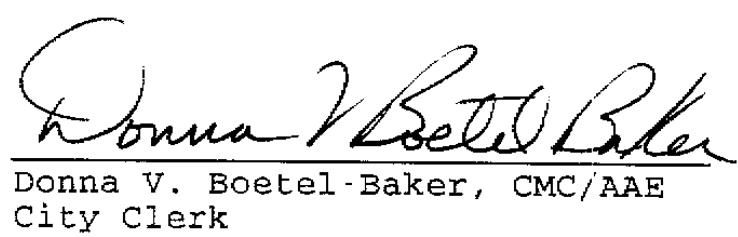

  

DONNA V.BOETEL-BAKER,CMCIAAE CITYCLEAK CITY HALL-2ND FOF dCCEA5=:RST SIE1 DESMCINES"WAUIA4↑151512834209  

PARKING TICKETS AND DOG LICENSES [5151783-412  

BUSINESS LICENSES 151283.4:2 ALL-AMERICA CITY 1949.I976.1981  

  

MEMO TO: Secretary of Statet Polk County Recorder  

Please file and record the enclosed documents and bill this office as appropriate:  

28-E Agreement for First Source Employment withi Fibrelite Corporation, approved by the Des Moines City Council on April 3, 1995 by Rol1 Ca11 N0. 95-1319.  

Thank you.  

  

/ ab Enclosures  