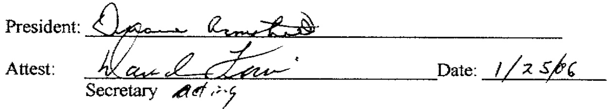
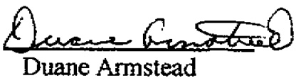
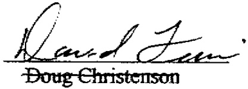
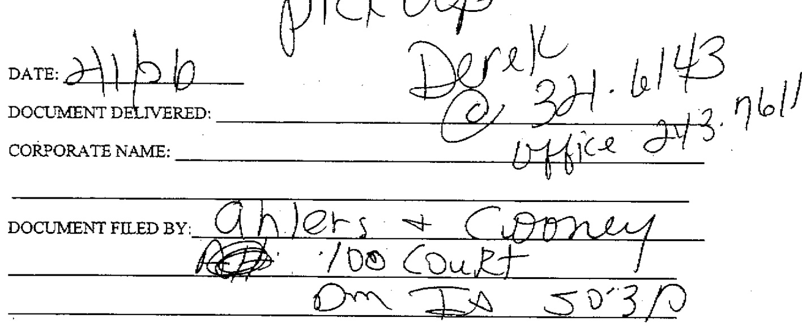

# Fra1 3 30 P1 'B6 RESOLUTION No. 2006-1  

RESOLUTION OF THE BOARD OF DIRECTORS OF SOUTH JOWA MUNICIPAL ELECTRIC ASSOCIATION (SIMECA)AGREEING TO AND ADOPTING THE PROVISIONS AND AGREEING TO BECOME A PARTY TO THE AGREEMENT ESTABLISHING THE IOWA STORED ENERGY PLANT AGENCY UNDER IOWA CODE CHAPTER 28E AS PREVIOUSLY ADOPTED BY THE ALGONA MUNICIPAL UTILITIES ANDWAVERLY LIGHT ANDPOWER  

WHEREAS SIMECA by action of its Board of Directors has determined it is in the best interest of SIMECA to enter into and become a party to the Agreement Establishing the Iowa Stored Energy Plant Agency under Iowa Code chapter 28E between the Algona Municipal Utilities and Waverly Power and Light filed with the Secretary of State of the State of lowa on August 19, 2005,and;  

WHEREAS SIMECA is making application to join the Agency created by the Agreement Establishing the Iowa Stored Energy Plant Agency under Iowa Code chapter 28E between the Algona Municipal Utilities and Waverly Power and Light filed with the Secretary of State of the State of Iowa on August 19, 2005;  

NOW THEREFORE BE IT RESOLVED BY the Board of Directors of SIMECA  

# That:  

SECTION ONE: The Agreement Establishing the lowa Stored Energy Plant Agency under Iowa Code chapter 28E between the Algona Municipal Utilities and Waverly Power and Light filed with the Secretary of State of the State of lowa on August 19, 2005, a copy of which is attached hereto as "Exhibit A" is hereby agreed to in accord with Article Fifteen of said Agreement and SIMECA hereby agrees and upon acceptance in accord with said Agreement and Bylaws to be bound by said Agreement and Bylaws made pursuant to the Agreement to the same extent as an original party.  

SECTION TWO: The President of SIMECA is authorized and directed to execute all necessary documents, and to submit the same, agreeing to be bound by said Agreement and Bylaws and to take all steps necessary and appropriate for SIMECA to become a member of the lowa Stored Energy Plant and Agency.  

  

# AGREEMENT ESTABLISHING THE IOWA STORED ENERGY PLANT AGENCY UNDER IOWA CODE CHAPTER Z8E  

BE IT REMEMBERED that for the mutual promises, covenants and considerations herein contained the Algona Municipal Utilities and Waverly Light & Power have entered into the following Agreement under lowa Code chapter 28E, 28F and 476A.20 et seq. to wit:  

Article One. The organization herein created is a separate legal entity, a body corporate and politic which shall be known as the Iowa Stored Energy Plant Agency (the "Agency"'). The purpose of the Agency is to provide joint and coordinated action regarding the acq ul s it ion, financing and administration of Member interest in an electric plant or plants using natural gas or other gases, wind, biomass, air or other simllar or related energy sources as a source for the generation of electrical power  

Article Two. The initial Members of the Agency are: Algona Municipal Utilities and Waveriy Light &Power.  

Article Three. The Agency shall have the power and authority to enter into contracts on behalf of the Agency to hire such employees, con suit ants, advisors and obtain such professional services as are deemed necessary for the design, siting, construction, financing, management and control of an electric plant or plants using natural gas or other gases, wind, biomass, air or other similar or related energy sources for the generation of electrical power, and may conduct such feasibility studies, or contract for the preparation of feasibility studies, of questions concerning financing, seismology, geology, meteorology, engineering and other technical matters related to the siting, designs, construction, financing, management or control of a stored energy plant and otherwise exercise all powers conferred by lowa Code chapter 28E, 28F and Sections 476A.20 through 476A.36 (2005), as amended, as contemplated by the Members of the Agency.  The Agency shall have the power and authority, subject to the terms of this Agreement, to design, site, construct, finance, manage, operate and control one or more electric plants using natural gas or other gases, wind, biomass, air or other similar or related energy sources for the generation of electrical power and issue its public bonds or obligations as it deems necessary to carry out its purposes.  

Article Four. The initial Board of Trustees of the Agency shall consist of Sheila Bishop, Neil Ruddy, Dennis Fannin, Scott Tonderum, and John Biisten. These Trustees shall serve until the first Annual meeting, at which an election of Trustees shall be held under terms stated in theBylaws.  

  

Article Six. The Board of Trustees shall adopt Bylaws consistent with this Agreement. The Bylaws shall provide for officers of the Agency. The Bylaws shall provide for the periodic meeting of the Board of Trustees and may provide for an executive committee which may act On behaif of the Agency between meetings of the Board of Trustees. The Agency's fiscal year shall be set in its Bylaws.  

Article Seven. The Board of Trustees may employ an executive director for the Agency and provide for direct employment of such other persons as are deemed necessary or prudent  

Article Eight. The Board of Trustees shall control the finances of the Agency and may expend or invest funds of the Agency as it deems necessary to accomplish the purposes of the Agency, provided, however, that all funds shall be invested in accord with lowa Code sections 12B.10 and 12B.10A through 12B.10C (2005), 0r successor laws.  

Article Nine. The Board of Trustees shall annually adopt a budget prior to the start of the Agency's fiscal year. The budget shall provide for such contributions from Members as may be deemed necessary. A copy of a proposed budget shall be forwarded to each Member at least 30 days before adoption. A copy of the budget as adopted shall be sent to each Member within ten days after adoption  

Article Ten. The Agency may join or form joint action agencies under the laws of this or any other state to carry out the purposes of this Agreement to the same extent as any Member could join or form such an agency.  

Article Eleven. The Agency is specifically empowered to exercise all powers available under lowa Code chapter 28F and lowa Code section 476A, subchapter II (2005, or successor laws) and for purposes of such chapters shall be an electric power agency. The terms "city utility," "electric power agency," "project” or "projects, “"facility” and other terms used in this Agreement or in Bylaws shall have the meanings ascribed in lowa Code sections 28F.2, 362.2 and 476A.20 (2005), as amended.  

Article Twelve. The Agency shall hold all real, personal and intangible property which it acquires in its own name. The Agency may acquire such property as it needs to accomplish its pubfic purposes by sale, exchange or otherwise. The Agency may also acquire real property by use of the power of eminent domain and is authorized to bring an action in eminent domain for a public purpose in its own name or may request a Member to bring such action, which the Member shall then do, but the agency shall fully reimburse the Member for all costs of acquisition including not only damages to be paid the owner but all administrative and related costs incurred by the Member to compiete the acquisition. The Agency may dispose of any of its property in the same manner as a city. All proceeds from the sale or disposition of property is property of the Agency. The Agency may accept contributions in any form.  

Article Thirteen. The Agency may administer development and other contracts and may take assignments of contract rights from Members or other public or private entities upon such terms and conditions as the Board of Trustees may deem proper or in the best interest of the Agency.  

Article Fourteen. The Agency shall hold allicenses and certificates necessary to its purposes in its own name or through affiliated entities formed by the Agency for specified purposes  

Article Fiffeen. Any city, city utility or organization composed of cities or city utilities or other public entity, whether organized under the laws of this or any other state may become a member of the Agency by making application and agreeing to comply with this Agreement and Bylaws adopted by the Board of Trustees.  

Article Sixteen. Any Member may withdraw as provided in the Bylaws  

Article Seventeen. This Agreement shall be perpetual, however, it may be terminated by agreement of all Members.  

Article Eighteen. Upon termination the Agency shall dispose of all assets and distribute the proceeds as provided in the Bylaws.  

Article Nineteen. This Agreement may be amended by the agreement of all Members.  

Adopted by Resolution at the meeting of South lowa Municipal Electric Cooperative Association on January 25, 2006.  

  

President Attested:  

  

Secretary  4e  

  

PHONE NUMBER:MC/VISA #, exp. CASH CHECK # BILLING # AMOUNT: S CLERKS: DB PK PM KU  