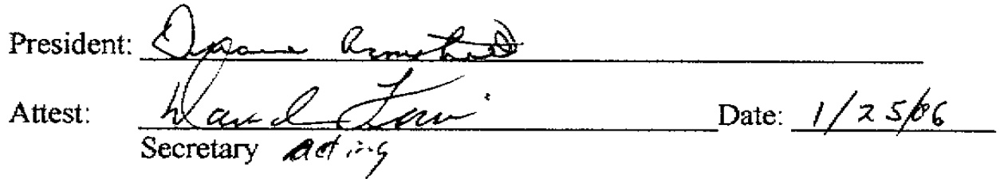

# Fra1 3 30 P1 'B6 RESOLUTION No. 2006-1  

RESOLUTION OF THE BOARD OF DIRECTORS OF SOUTH JOWA MUNICIPAL ELECTRIC ASSOCIATION (SIMECA)AGREEING TO AND ADOPTING THE PROVISIONS AND AGREEING TO BECOME A PARTY TO THE AGREEMENT ESTABLISHING THE IOWA STORED ENERGY PLANT AGENCY UNDER IOWA CODE CHAPTER 28E AS PREVIOUSLY ADOPTED BY THE ALGONA MUNICIPAL UTILITIES ANDWAVERLY LIGHT ANDPOWER  

WHEREAS SIMECA by action of its Board of Directors has determined it is in the best interest of SIMECA to enter into and become a party to the Agreement Establishing the Iowa Stored Energy Plant Agency under Iowa Code chapter 28E between the Algona Municipal Utilities and Waverly Power and Light filed with the Secretary of State of the State of lowa on August 19, 2005,and;  

WHEREAS SIMECA is making application to join the Agency created by the Agreement Establishing the Iowa Stored Energy Plant Agency under Iowa Code chapter 28E between the Algona Municipal Utilities and Waverly Power and Light filed with the Secretary of State of the State of Iowa on August 19, 2005;  

NOW THEREFORE BE IT RESOLVED BY the Board of Directors of SIMECA  

# That:  

SECTION ONE: The Agreement Establishing the lowa Stored Energy Plant Agency under Iowa Code chapter 28E between the Algona Municipal Utilities and Waverly Power and Light filed with the Secretary of State of the State of lowa on August 19, 2005, a copy of which is attached hereto as "Exhibit A" is hereby agreed to in accord with Article Fifteen of said Agreement and SIMECA hereby agrees and upon acceptance in accord with said Agreement and Bylaws to be bound by said Agreement and Bylaws made pursuant to the Agreement to the same extent as an original party.  

SECTION TWO: The President of SIMECA is authorized and directed to execute all necessary documents, and to submit the same, agreeing to be bound by said Agreement and Bylaws and to take all steps necessary and appropriate for SIMECA to become a member of the lowa Stored Energy Plant and Agency.  

  