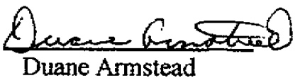
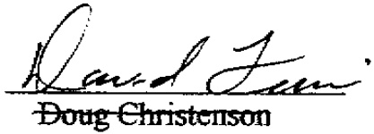

disposition of property is property of the Agency. The Agency may accept contributions in any form.  

Article Thirteen. The Agency may administer development and other contracts and may take assignments of contract rights from Members or other public or private entities upon such terms and conditions as the Board of Trustees may deem proper or in the best interest of the Agency.  

Article Fourteen. The Agency shall hold allicenses and certificates necessary to its purposes in its own name or through affiliated entities formed by the Agency for specified purposes  

Article Fiffeen. Any city, city utility or organization composed of cities or city utilities or other public entity, whether organized under the laws of this or any other state may become a member of the Agency by making application and agreeing to comply with this Agreement and Bylaws adopted by the Board of Trustees.  

Article Sixteen. Any Member may withdraw as provided in the Bylaws  

Article Seventeen. This Agreement shall be perpetual, however, it may be terminated by agreement of all Members.  

Article Eighteen. Upon termination the Agency shall dispose of all assets and distribute the proceeds as provided in the Bylaws.  

Article Nineteen. This Agreement may be amended by the agreement of all Members.  

Adopted by Resolution at the meeting of South lowa Municipal Electric Cooperative Association on January 25, 2006.  

  

President Attested:  

  

Secretary  4e  