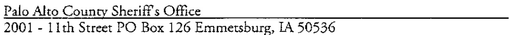
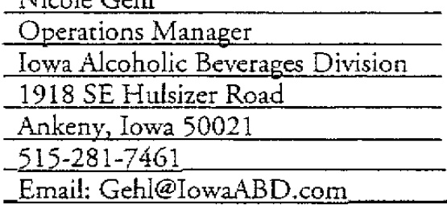
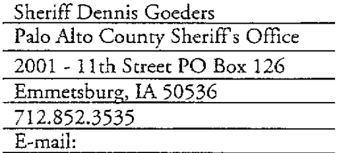
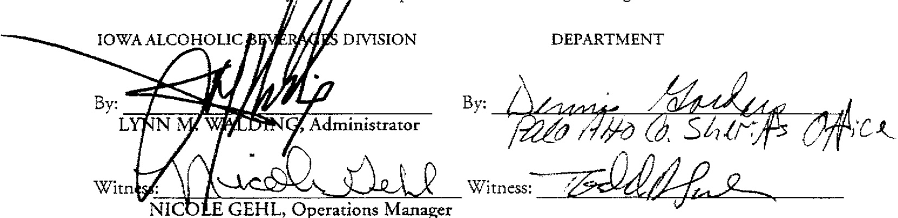

# SCHEDULE HH  

THIS, AGREEMENT is made and entered into on this SHday of 2006 by and between the Iowa Alcoholic Beverages  

(the "Department"). The parties agree as follows:  

# SECTION 1. IDENTITY OF THE PART1ES  

1. 1 Iowa ABD. The ABD is authorized pursuant to Iowa Code Chapter 142A ad a 28E Agreement with the lowa Deparrment of Public Health to provide en for caa ent for Iowa's tobacco laws. The ABD's address is: 1918 SE Hulsizer Road, Ankeny, Iowa50021.  

1.2 Department. The Department operates a duly recognized Iowa law enforcement agency. The Department's addres is:  

  

SECTION 2. PURPOSE. The parries have entered into this Agreement for the purpose of providing and funding tobacco enforcement activities in compliance with Iowa Code  $\S$  453A.2(2003)  

SECTION 3. TERM. The rerm of the Agreement shall be from the aforementioned date through June 30, 2007, unless earlier terminated in accordance with the terms of the Agreement.  

SECTION 4. FILING. Pursuant to Iowa Code  $\S~{\it28\mathrm{E}}{\it8},$  the ABD shall file the Agreement with the lowa Secretary of State and the Department shall file the Agreement with the applicable County Recorder.  

# SECTION 5. RESPONSIBILITIES OF THE PARTIES  

# 5.1 Responsibilities of the Department.  

5.1.1   Local Tobacco Enforcement.  The Department shall provide tobacco enforcement of lowa Code S 453A.  

5.1.2 Compliance Checks. The Department shall perform one compliance check of each tobacco permit holder, and a second compliance check on each permit holder who was non compliant the first time checked during the term of the Agreemenr. The first compliance check shall be completed and submitted for reimbursement to ABD by April 15, 2007. The second compliance check shall be completed and submitted for reimbursement to ABD by June 1, 2007.  Clerks that fail compliance checks shall be ticketed criminally. The Department shall, within seven (7) days, notify the retail owner or manager of any violation. The second compliance check shall be conducted in a timely manner, but shail not occur until retailers have been notified if they were found to be non-compliant during the first check and passage of a reasonable amount of time. Within seventy-rwo (72) hours of a Department issuing a citation for a violation of Iowa Code  $\S$  453A.2(1) toa permit-hoider or employee of a permit-holder, the Department must notify the local permit-issuing authoriry that issued the cigarette permit to the ferailer where the offense was committed.  

5.1.3 Retail Employee Training. The Departmenr shall participate in a tobacco compliance employee-training program. The Deparment shall schedule one (1) I-Pledge Training Class per month from July 1, 2006 through June 30, 2007. ABD shall pay a flat fee of  $\mathbb{S}100$  to the Department for each class they instruict.  

S.1.4 Youth Volunteers. Utilization of youth volunteers is strongly encouraged where feasible. The Department may compensate the youth involved in the compliance checks in a manner consistent with Section 6. The Department may seek youth volunteers through the local tobacco community partnership program.  

5.1.5 Routine Enforcement. In addition to conducting compliance checks, the Deparrment agrees to regularly enforce youth smoking laws by ticketing youth offenders.  

5.1.6 Cops-in-Shops.  The Department agrees to cooperate with the ABD in conducting “cops-in-shops," or similar programs designed to derer youth from attempting to purchase cigarettes or tobacco products.  

5.1.7 Civil Proceedings. The Department shall cooperate with city, county and state prosecutors if civil permir proceedings are initiated against a tobacco permit holder. The Department shall also cooperate in proceedings against cited clerks and minors. Cooperation shall include, but not be limired to, sharing investigative reports and copies of issued citations, as well as providing witness statements and testimony.  

5.1.8 Compliance Reports. The Department shall provide monthly reports to the ABD in the manner prescribed by the ABD. In addition, if requested, the Department shall provide this data to the Iowa Department of Public Health for  audit or performance evaluation to  meet reporring requirements established by the Iowa Legislature or by the Office of the Governor of Iowa.  

5.1.9 Communiry Partnership. The Department shall fully cooperate with, and be an active participant in, their local tobacco community partnership. Community partnerships are charged with reducing tobacco use by youth and pregnant women, as well as working to promote compliance by minors and retailers with tobacco sales laws and ordinances. If a local community o art ner ship does not exisr at the time the Agreemenr is executed, the Department shall become an active participant within thirty (30) days of the establishment of a local community partnership  

5.1.10 Miscellaneous. The Department shall be responsible for the day-to-day administration of their tobacco enforcement activities. The Department shall provide all office space, equipment and personnel necessary to conduct tobacco enforcement activities under the Agreement.  The Department is solely responsible  for the selection, hiring. disciplining. firing and compensation of its officers.  

# 5.2 Responsibilities of the ABD  

5.2.1  Enforcement Guidance.  The ABD shall provide guidance on tobacco enforcement to the Department, if needed, and cooperate with the Department in the performance of the Agreement.  

5.2.2 Payment. The ABD shall pay the Department in the manner described in Section 6.  

5.2.3 Cooperation. If ABD believes that any officer of the Departmenr fails to perform duties in a manner that is consistent with the Agreement, the ABD shall notify the Department. The Department shall then take such action as necessary to investigate and, if appropriate, discipline or reassign the officer away from tobacco enforcement activities. The ABD shall have no authority to discipline or reassign an officer, except that the ABD shall have the authority to stipulate that a particular officer not be assigned to provide services under the Agreement.  

5.2.4 Insurance, Benefits and Compensation. The ABD shall not provide for, nor pay, any empioyment costs of the Department's officers including, but not limited to, worker's compensation, unemployment insurance, health insurance, life insurance and any other benefits or compensation, nor make any payroll payments with respect to the Department's officers. The ABD shall have no liability whatsoever for all such employment costs or other expenses relating to, or for the benefit of, the Department's officers.  

6.1 Method of Payment. In consideration for providing the services required by the Agreement, the Department shall be paid on a flat fee basis of fifty dollars  $\{\mathfrak{H}\,50\}$  pe1 reporred compliance check.  The flat fee payment for each compliance check constitutes the full and exclusive remuneration for the compliance checks.  For example, compensation of youth participants is the sole responsibility of the Departmenr and is to be paid from the flat fee payment.  

6.2 Eligible Claims. Compliance checks that were conducted on 0r after July 18, 2006, are eligible for payment provided that the results are reported in accordance with Section 5. Any compliance checks that were funded by a non-departmental entity are not eligible for payment.  

6.3 Allocations. The costs of the services referred ro in Section 6.1 shall be allocated as follows:  

5.3.1 Sole Activity. Money paid to the Deparrment, pursuant to the Agreement, shall be used to fund overtime of full- or part-time peace officer positions solely for tobacco enforcement activities described in the Agreement. 5.3.2 Payment in Arrears. T'he ABD may pay all approved invoices in arrears and in conformance with Iowa Code  $\S$  421.40. The ABD, consistent with Iowa Code S 421.40, may pay in less than the specified time period. Payment by the ABD in fewer than sixry (60) days, however, does not constitute an implied waiver of that Code section.  

SECTION 7. ADMINISTRATION OF AGREEMENT. The ABD and the Department shall jointly administer the Agreement.  

SECTION 8. NO SEPARATE ADMINISTRATIVE ENTITY. No new or separate legai or administrative entity is created by the Agreement.  

SECTION 9.  NO PROPERTY ACQUIRED.  The ABD and the Department, in connection with the performance of the Agreement, shall acquire no real or personal property.  

# SECTION 10. TERM IN AT 1 ON.  

1 0.1 Termination For Convenience. Following thirty (30) days wrirten notice, either party may terminate the Agreement, in whole or in part, for convenience without the payment of any penalty or incurring any further obligation to the non-terminating party. Following termination for convenience, the non-terminating party shall be entitled to compensation, upon submission of invoices and proper proof of claim, for services provided under the Agreement to the terminating party up to and including the date of termination.  

10.2 Termination for Cause. The occurrence of any one or more of rhe following evenrs shall constitute cause for any party to declare another party in default of its obligations under the Agreemenr:  

10.2.1 Failure to observe and perform any covenant, condition or obligation created by the Agreement; 10.2.2 Failure to make substantial and timely progress roward performance of the Agreement; 10.2.3 Failure of the party's work product and services to conform with any specifications noted herein; 10.2.4 Infringement of any patent, trademark, copyright, trade dress or any other intellectual property right.  

10.3 Notice of Default. If there occurs a default event under Section 10.2, the nondefaulting party shall provide written notice to the defauiting party requesting that the breach or noncompliance be immediately remedied. In the event that the breach or noncompliance continues to be evidenced ten days beyond the date specified in the written notice, the non-defaulting party may either:  

10.3.1 Immediately terminate the Agreement without additional written notice; or. 10.3.2 Enforce the terms and conditions of the Agreement and seek any available legal or eqlitable remedies. In either event, the non-defauiting party may seek damages as a result of the breach or failure to comply with the terms of the Agreement.  

# SECTION 11. 1 NDE MN IF ICA I 1 ON.  

1 1.1 By ABD. Consistenr with Article VIl, Section 1 of the Iowa Constitution and Iowa Code Chapter 669, ABD agrees to defend and indemnify the Department and hold it harmiess against any and all liabilities, damages, settlements, judgments, costs and expenses, including reasonable attorneys fees of counsel required to defend the Department, related to or arising out of ABD's negligent or wrongfui acts or omissions in the performance of the Agreement.  

11.2 By the Department.Consistent with Article Vll, Section 1 of the Iowa Constitution and Iowa Code Chapter 670, the Department agrees to defend and indemnify and hold the State of Iowa and ABD harmless from any and all liabilities, damages, set tie men rs, judgments, costs and expenses, including reasonable govern men ral attorney's fees and the costs and expenses of attorney fees of other counsel required to defend the ABD, related to or arising fromanyneg igent or wrongful acts or omissions of the Department in the performance of this Agreemenr.  

12.1 Contacr Person. At the time of execution of the Agreement, each party shall designate, in writing, a Contact Person to serve until the expiration of the Agreement or the designation of a substitute Contacr Person. During the term of the Agreement, each Contact Person shall be available to meet, as otherwise mutuailly agreed, to plan the services being provided under the Agreement.  

SEC1MON 13. CONIRACT ADMIN IS TRA 1 ION.  

13. 1 Amendments.  The Agreement may be amended in writing from time to time by mutual consent of the parries. All amendments to the Agreement must be fuilly executed by the parties.  

13.2 Third Party Beneficiaries. There are no third party beneficiaries to the Agreement. The Agreement is intended only to benefit ABD and the Department.  

13.3 Choice of Law and Forum. The terms and provisions of the Agreement shall be construed in accordance with the laws of the Stare of Iowa. Any and all litigation or actions commenced in connection with the Agreement shall be brought in Des Moines, Iowa, in Polk County District Court for the State of Iowa. This provision shall not be construed as waiving any immuniry to suit or liability that may be available to the State of Iowa, ABD or the Department.  

13.4 Assignment and Delegation. The Agreement may not be assigned, transferred or conveyed in whole or in part without the prior written consent of the other party.  

13.5 Integration.  The Agreement represents the entire Agreement between the parties and neither party is relying on any representation that may have been made which is not included in thhe Agreement.  

13.6 Headings or Captions. The paragraph headings or captions are for identification purposes only and do not limit nor construe the contents of the paragraphs.  

13.7 Not a Joint Venrure. Nothing in the Agreement shall be construed as creating or constituting the relationship of a partnership, joint venture, association of any kind or agent and principal relationship between the parties. Each party shall be deemed an independent contractor acting toward the expected mutual benefits. No party, unless otherwise specifically provided for herein, has the authority to enter into any contract or create an obligation or liability on behalf of, in the name of, or binding upon the other party to the Agreement.  

13.8 Supersedes Former Agreements. The Agreement supersedes all prior Agreements between ABD and the Department for the services provided in connection with the Agreement.  

13.9 Waiver. Except as specifically provided for in a waiver signed by duly authorized representatives of ABD and the Department, failure by any party at any time to require performance by the other party or to claim a breach ot any provision of the Agreement shall not be construed as affecting any subsequent breach or the right ro require performance with respect thereto or to claim a breach with respect thereto.  

13.10 Notices.  Notices under the Agreement shall be in writing and delivered to the representative of the party to receive notice (identified below) at the address of the parry to receive notice as it appears below or as otherwise provided for by proper notice here under. This person shall be the Contacr Person. The effective date for any notice under the Agreement shall be the date of delivery of such notice (nor the date of mailing) which may be effected by certified U.S. Mail return receipt requested with postage prepaid thereon or by recognized overnight delivery service, such as Federal Express or UPS. Failure to accept "receipt" shall constitute delivery.  

If to ABD:  

If to Department:  

  

  

13.11 Cumulative Rights. The various rights, powers, options, elections and remedies of any party provided in the Agreement, shal be construed as cumulative and not one of them is exclusive of the others or exclusive of any rights, remedies or priorities allowed any party by law, and shall in no way affect or impair the right of any party to pursue any other equitable or legal remedy to which any party may be entitled as long as any default remains in any way unremedied, unsatisfied or un discharged.  

13.12 Sever ability. If any provision of the Agreement is determined by a court of competent jurisdiction to be invalid or unenforceable, such determination shall not affect the validiry or enforce a bil iry of any orher part or provision of the Agreement.  

13.13 Time is of the Essence. Time is of the essence with respect to the performance of the terms of rhe Agreement.  

13.14 Authorization. Each party to the Agreement represents and warrants ro the other that:  

13.14.1  It has the right, power and authoriry to enter into and perform its obligations under the Agreement. 13.14.2  It has taken afl requisite action (corporate, statutory or otherwise) to approve execution, delivery and performance of the Agreement, and the Agreement const iru tes a legal, valid and binding obligation upon itself in accordance with its terms.  

13.15 Successors in Interest. All the terms, provisions and conditions of the Agreement shall be binding upon and inure to the benefir of the parries hereto and their respective sli cc ess or s, assigns and legal representatives.  

13.16 Record Retention and Access. The Department shall maintain books, records and documents which sufficiently and properly document and calculate all charges billed to ABD throughout the term of the Agreement for a period of ar least three (3) years following the date of final payment or completion of any required audit, whichever is ater, The Department shall permit the Auditor of the Stare of Iowa or any authorized representative of the State and where federal funds are involved, the Comptroller General of the United States or any other authorized represent a rive of the United States government, to access and examine, audit, excerpt and transcribe any directly pertinent books, documents, papers, electronic or optically stored and created records or other records of the Department relating to orders, invoices, or payments or any other documentation or materials pertaining to the Agreement. The Department shall not impose a charge for audit or examination of the books and fecords.  

13.17 Additional Provisions.  The parties agree that any Addendum, Rider or Exhibit, attached hereto by the parties, shall be deemed incorporated herein by reference.  

13.18 Further Assurances and Corrective Instruments. The parties agree that they shall. from time to time, execute, acknowledge and deliver, or cause to be executed, ac know i edged and delivered, such supplements hereto and such further instruments as may reasonably be required for carrying out the expressed intention of the Agreement.  

SECT1ON 14. EXECUTION  

IN WITNESS WHEREOA, in consideration of the mutual covenants set forth above and for other good and/vqluable consideration, the receipt, adequacy and legal sufficiency of which are hgreby A cl now ledge d, the parties have entered into the Agreement and have caused their duly aut br j zed representatives to execute the Agreement.  

  

# Memorandum  

To: Cusromer Service, Iowa Secretary of State's Office From: Nicole Gehl, Operations Manager Re: 28E Agreements for Tobacco Enforcement  

Please file the enclosed FY07 28E Agreements for tobacco enforcement.  

You may contact me at 515.281.7461 or Gehl@lowaABD,com with any questions or comments. Thank you.  

# August 30, 2006  

NICOLE GEHL, OP MANAGER ALCOHOLIC BEVERAGES DIV 1918 SE HULSIZER RD ANKENY, 1A 50021  

RE: Filing of 28E Agreement between the ALCOHOLIC BEVERAGE DIVISlON and the PALO ALTO COUNTY SHERIFF'S OFFICE  

Dear MS GEHL, OP MANAGER  

We have received the above described agreement which you have submitted to this office for filing, pursuant to the provisions of Chapter 28E, Code of lowa  

You may consider the same fled as of August 30, 2006. Sincerely,  

  

Chester J Culver Secretary of State  

CJC/pm Enclosures  