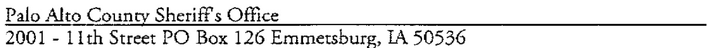

# SCHEDULE HH  

THIS, AGREEMENT is made and entered into on this SHday of 2006 by and between the Iowa Alcoholic Beverages  

(the "Department"). The parties agree as follows:  

# SECTION 1. IDENTITY OF THE PART1ES  

1. 1 Iowa ABD. The ABD is authorized pursuant to Iowa Code Chapter 142A ad a 28E Agreement with the lowa Deparrment of Public Health to provide en for caa ent for Iowa's tobacco laws. The ABD's address is: 1918 SE Hulsizer Road, Ankeny, Iowa50021.  

1.2 Department. The Department operates a duly recognized Iowa law enforcement agency. The Department's addres is:  

  

SECTION 2. PURPOSE. The parries have entered into this Agreement for the purpose of providing and funding tobacco enforcement activities in compliance with Iowa Code  $\S$  453A.2(2003)  

SECTION 3. TERM. The rerm of the Agreement shall be from the aforementioned date through June 30, 2007, unless earlier terminated in accordance with the terms of the Agreement.  

SECTION 4. FILING. Pursuant to Iowa Code  $\S~{\it28\mathrm{E}}{\it8},$  the ABD shall file the Agreement with the lowa Secretary of State and the Department shall file the Agreement with the applicable County Recorder.  

# SECTION 5. RESPONSIBILITIES OF THE PARTIES  

# 5.1 Responsibilities of the Department.  

5.1.1   Local Tobacco Enforcement.  The Department shall provide tobacco enforcement of lowa Code S 453A.  