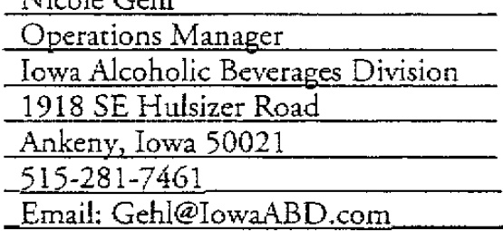
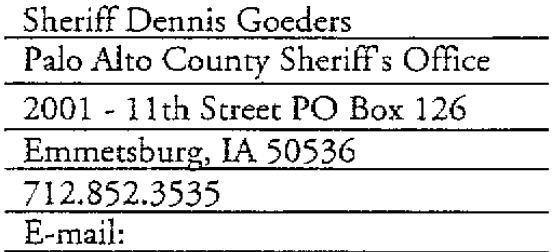

Agreement shall not be construed as affecting any subsequent breach or the right ro require performance with respect thereto or to claim a breach with respect thereto.  

13.10 Notices.  Notices under the Agreement shall be in writing and delivered to the representative of the party to receive notice (identified below) at the address of the parry to receive notice as it appears below or as otherwise provided for by proper notice here under. This person shall be the Contacr Person. The effective date for any notice under the Agreement shall be the date of delivery of such notice (nor the date of mailing) which may be effected by certified U.S. Mail return receipt requested with postage prepaid thereon or by recognized overnight delivery service, such as Federal Express or UPS. Failure to accept "receipt" shall constitute delivery.  

If to ABD:  

If to Department:  

  

  

13.11 Cumulative Rights. The various rights, powers, options, elections and remedies of any party provided in the Agreement, shal be construed as cumulative and not one of them is exclusive of the others or exclusive of any rights, remedies or priorities allowed any party by law, and shall in no way affect or impair the right of any party to pursue any other equitable or legal remedy to which any party may be entitled as long as any default remains in any way unremedied, unsatisfied or un discharged.  

13.12 Sever ability. If any provision of the Agreement is determined by a court of competent jurisdiction to be invalid or unenforceable, such determination shall not affect the validiry or enforce a bil iry of any orher part or provision of the Agreement.  

13.13 Time is of the Essence. Time is of the essence with respect to the performance of the terms of rhe Agreement.  

13.14 Authorization. Each party to the Agreement represents and warrants ro the other that:  

13.14.1  It has the right, power and authoriry to enter into and perform its obligations under the Agreement. 13.14.2  It has taken afl requisite action (corporate, statutory or otherwise) to approve execution, delivery and performance of the Agreement, and the  